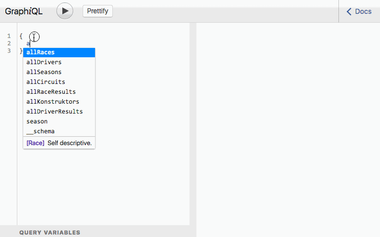

# Apollo Server F1 API Wrapper 

  A GraphQL wrapper around [Ergast F1 REST API](http://ergast.com/mrd/) built using Apollo Server.

 


## What is Apollo Server & GraphQL

Apollo Server is a data stack for modern applications built with [GraphQL](https://medium.com/apollo-stack/the-basics-of-graphql-in-5-links-9e1dc4cac055#.yr1awqpig), a 
technology developed by Facebook in 2012 and open sourced in July 2015. If you've used Facebook in the past few years, 
you're getting your data via GraphQL. 

The benefits of using Apollo Server/GraphQL as a data service layer are abundant. Generally speaking, there are the main benefits:

1. **Exact Data** - fetch the precise data your view needs, fast! No more, no less.
2. **Any Source** - retrieve data from SQL, NoSQL, REST or all of the above in a single call.
3. **Unobtrusive** - slides into any server stack without demands on server side engineers.
4. **Self Documenting** - model objects are strongly typed, hence discoverable and self documenting.


### What It's Not

Apollo/GraphQL is not a data storage engine. It is not a graph database. It is a data service layer that revolutionizes
data retrieval. Querying data is easy and straightforward with simple JSON notation - regardless of your data storage engine.

For example, here's a basic query to get a list of races. (Yes, commas are optional.)   

```GraphQL
{
  allRaces {
    raceName
  }
}
```

The query above yields the JSON object below shaped exactly as your request. This eliminates over and under fetching.

```JSON
{
  "data": {
    "allRaces": [
      { "raceName": "British Grand Prix" },
      { "raceName": "Monaco Grand Prix" },
      { ... }
    ]
  }
}
```

### Parameters

Refine results by passing arguments.

```GraphQL
{
  allRaces(year:2016) {
    raceName
  }
}
```

### Nested Data

If you need nested data without myriad of round trips, no problem. The query below retrieves all the races 
in 1950 and includes the circuit and location of the race track. 

```GraphQL
{
  allRaces(year:1950) {
    raceName
    circuit {
      circuitName
      location {
        country
        lat
        long
      }
    }
  }
}
```

## Custom Endpoints

So often custom REST endpoints are needed to satisfy _view_ requirements and their variants. 
Apollo Server defines **one** endpoint and lets each view define the data it needs. This flexibility
eliminates the need to create a multitude of custom RPC (aka ad hoc) endpoints typical with REST API's.  


## Multiple Data Sources

Another beauty of Apollo Server is it's ability to access any data source including REST API's. 
What's more is any single call can be be mix of one or more data sources. The Apollo Server makes
all the calls to the appropriate data sources and sends back a single object to the client. 

## REST Wrapping

Another benefit of Apollo Server is wrapping any existing REST API so once chatty or 
bloated calls can now be tailored to the exact data a _view_ needs in a single call. 
Over time more REST API's will be wrapped with Apollo Server/GraphQL. Here are a few public ones:

* [Apollo SWAPI](https://github.com/nnance/swapi-apollo)
* [GraphQL Hub](https://www.graphqlhub.com/)


This project is an Apollo Server wrap of the Ergast F1 REST API which is leans towards an RPC style API
as opposed to a Resource style API. Given that, the major benefit from wrapping this API is to minimize 
response object bloat which is friendlier to mobile apps. 

I encourage anyone who needs to get data to a client to experience this revolutionary data retrieval 
technology for yourself.

This project uses:

* [apollo-server](https://github.com/apollostack/apollo-server) - Apollo server GraphQL middleware for express.
* [graphql-js](https://github.com/graphql/graphql-js) - a JavaScript GraphQL runtime.
* [DataLoader](https://github.com/facebook/dataloader) - for coalescing and caching fetches.
* [GraphiQL](https://github.com/graphql/graphiql) - for easy exploration of this GraphQL server.

## Getting Started

Install dependencies with

```sh
npm install
```

## Local Server

A local express server is in `./src`. It can be run with:

```sh
npm start
```

A GraphiQL instance is available at http://localhost:3030/graphql to
explore the API.

## Development Server

A development server that watches for changes can be run with:

```sh
npm run dev
```

### Credits
This project was inspired by Nick Nance's [Apollo SWAPI](https://github.com/nnance/swapi-apollo).
